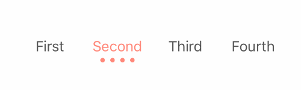

# TKDotSegment
> A segment with dot animation

[![Swift Version][swift-image]][swift-url]
[](https://raw.githubusercontent.com/TBXark/TKDotSegment/master/LICENSE)
[](http://cocoapods.org/?q= TKDotSegment)
[](http://cocoapods.org/?q= TKDotSegment)
[](https://github.com/Carthage/Carthage)
[](https://www.apple.com/nl/ios/)




## Requirements

- iOS 8.0+
- Xcode 8.0
- Swift 3.0

## Installation

#### CocoaPods
You can use [CocoaPods](http://cocoapods.org/) to install `TKDotSegment` by adding it to your `Podfile`:

```ruby
platform :ios, '8.0'
use_frameworks!
pod 'TKDotSegment'
```

To get the full benefits import `TKDotSegment` wherever you import UIKit

``` swift
import UIKit
import TKDotSegment
```
#### Carthage
Create a `Cartfile` that lists the framework and run `carthage update`. Follow the [instructions](https://github.com/Carthage/Carthage#if-youre-building-for-ios) to add `$(SRCROOT)/Carthage/Build/iOS/TKDotSegment.framework` to an iOS project.

```
github "tbxark/TKDotSegment"
```
#### Manually
1. Download and drop ```TKDotSegment.swift``` in your project.  
2. Congratulations!  

## Usage example

```

let titles = ["First", "Second", "Third", "Fourth"]
let  segment = TKDotSegmentControl(titles: titles, frame: CGRect(x: 0, y: 0, width: 300, height: 40))
segment.dotColor = UIColor(red:1,  green:0.539,  blue:0.490, alpha:1)
segment.selectTitleColor = UIColor(red:1,  green:0.539,  blue:0.490, alpha:1)
segment.numOfDot = 4
segment.dotSpace = 6
segment.clickAction = { (index: Int, changeOffset: Bool) in
    print("Segment Select Index: \(index)")
}

```

### Base

|变量名|描述|Description|
|---|---|---|
|titles|选项标题|segment title|
|numOfDot|圆点数目| dot count|
|dotDiameter|圆点直径|dot diameter|
|dotSpace|圆点间距(负数则自动计算)|dot space(automatic calculation when value is a positive number)|
|dotColor|圆点颜色|dot color|
|selectTitleColor|标题被选中时的颜色|The color of the title is selected|
|unSelectTitleColor|标题未被选中时的颜色|The color of the title is not selected|
|titleFont|标题字体|The  font of the title |
|PLDot|圆点(可重写drawRect来自定义形状)|Override drawRect to customize shape|


---
1 . 改变 Index (change index)

```
    func changeSelectedIndex(index: Int, animate: Bool = true)
```

2 . 接受 Index 变化事件 (index value change event)

```
TKDotSegmentAction = (index: Int,  internaliFlag: Bool) -> Void

```

`index` 被选择的 index (selected index)

`internaliFlag` 是否内部点击触发的标志位 (event by click flag)

3 . 自定义圆点形状(Custom dot shape)

重写`PLDot` 的 `drawRect` 方法就可以了

Overwrite the ` drawRect`  of ` PLDot `


## Release History

* 1.3.1
  Support swift 3.0

* 1.0.2
  Complete basic functions, add Cocoapod and Carthage support

## Contribute

We would love for you to contribute to **TKDotSegment**, check the ``LICENSE`` file for more info.

## Meta

TBXark – [@tbxark](https://twitter.com/tbxark) – tbxark@outlook.com

Distributed under the MIT license. See ``LICENSE`` for more information.

[https://github.com/TBXark](https://github.com/TBXark)

[swift-image]:https://img.shields.io/badge/swift-3.0-orange.svg
[swift-url]: https://swift.org/
[license-image]: https://img.shields.io/badge/License-MIT-blue.svg
[license-url]: LICENSE
[travis-image]: https://img.shields.io/travis/dbader/node-datadog-metrics/master.svg?style=flat-square
[travis-url]: https://travis-ci.org/dbader/node-datadog-metrics
[codebeat-image]: https://codebeat.co/badges/c19b47ea-2f9d-45df-8458-b2d952fe9dad
[codebeat-url]: https://codebeat.co/projects/github-com-vsouza-awesomeios-com
